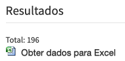
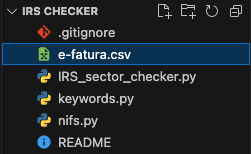

# Portugal E-fatura Classification Script

This script helps you identify and print entries in your receipts CSV file that might be misclassified. It considers two criteria:

1. Entries with NIFs that were previously classified as anything other than "Outros".
2. Entries with names containing keywords related to a specific category.

## How to Use

1. **Download the scripts:**
    - Download all the script files from the repository.

2. **Upload the CSV File:**
    - Download your receipts CSV file accessible via [e-fatura portal](https://faturas.portaldasfinancas.gov.pt/consultarDocumentosAdquirente.action)
    - 
    - Add the csv file to the root directory of this project.
    - 

3. **Run the Script:**
    - Open a terminal or command prompt in the root directory of the project.
    - Run the following command:
        ```
        python IRS_sector_checker.py
        ```

4. **Review Output:**
    - The script will process the CSV file and print entries that might be misclassified based on the specified criteria.

## Additional Notes

- The CSV file should be formatted with data separated by ";".
- The script does not modify the original data; it only prints potentially misclassified entries.

## Categories Supported

The script currently supports the following categories:
- Restauração
- Educação
- Ginásios
- Reparação de automóveis
- Saúde
- Veterinário
- Transportes Públicos
- Cabeleireiros

## Important Note

⚠️ **Possibility of Unidentified Receipts:**
Due to the script considering your existing receipts and provided information, it's possible that some receipts might not be identified. However, the script aims to provide valuable insights for most entries.
